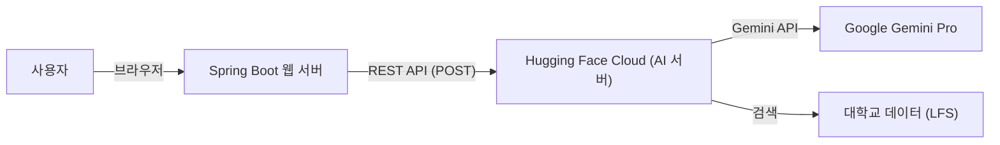

# 01. AI 챗봇 통합 개발 가이드 (Integration Guide)

이 문서는 `StudyLink-Web` (Spring Boot)과 파이썬 AI 서버(`chatbot_withpy`)의 전체적인 연결 구조와 설정 방법을 기술합니다.

---

## 1. 시스템 아키텍처 (Architecture)

### 구조도

### 핵심 개념

- **분리 배포**: 웹 서비스는 Spring Boot가, AI 엔진은 Hugging Face가 담당하는 하이브리드 구조입니다.
- **클라우드 전용**: 모든 AI 로직이 클라우드에 있으므로, 팀원들은 로컬에 파이썬을 설치하지 않아도 기능을 테스트할 수 있습니다.

---

## 2. 서버 설정 정보

### 파이썬 AI 서버 (Hugging Face)

- **플랫폼**: Hugging Face Spaces (Docker SDK)
- **포트**: 7860 (고정)
- **API 종류**: FastAPI
- **주요 엔드포인트**:
  - `POST /chat`: 사용자 질문에 대한 AI 답변 생성
  - `GET /health`: 서버 상태 및 로드된 데이터 정보 확인

### Spring Boot 연결 설정

- **파일 위치**: `ChatbotService.java`
- **AI 서버 URL**: `https://yaimnot23-chatbot-docker.hf.space/chat`
- **통신 방식**: `RestTemplate`을 사용한 JSON POST 요청

---

## 3. 팀원 협업 가이드 (Collaborator's Guide)

### 코드를 새로 받았을 때

1.  `dev` 브랜치를 Pull 받습니다.
2.  `StudyLink-Web` 프로젝트만 실행합니다.
3.  브라우저에서 `localhost:8080` 접속 후 챗봇 버튼을 클릭하여 테스트합니다.

### 주의사항

- Hugging Face 서버는 48시간 동안 요청이 없으면 자동으로 **절전 모드**에 들어갑니다.
- 만약 답변이 오지 않는다면 [Hugging Face Space](https://huggingface.co/spaces/yaimnot23/chatbot_docker)에 접속해서 서버를 깨워주어야 합니다.
