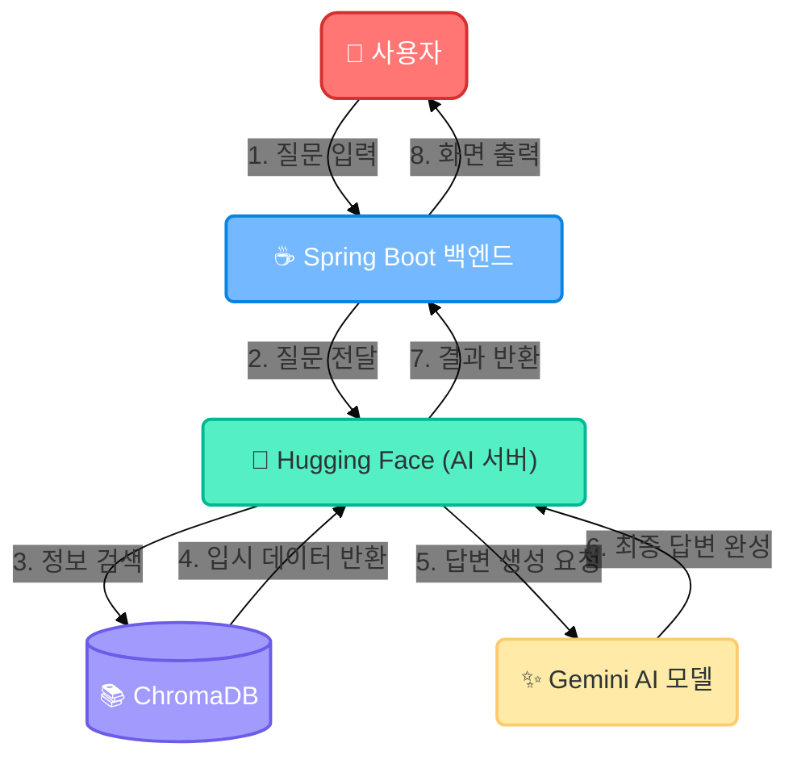
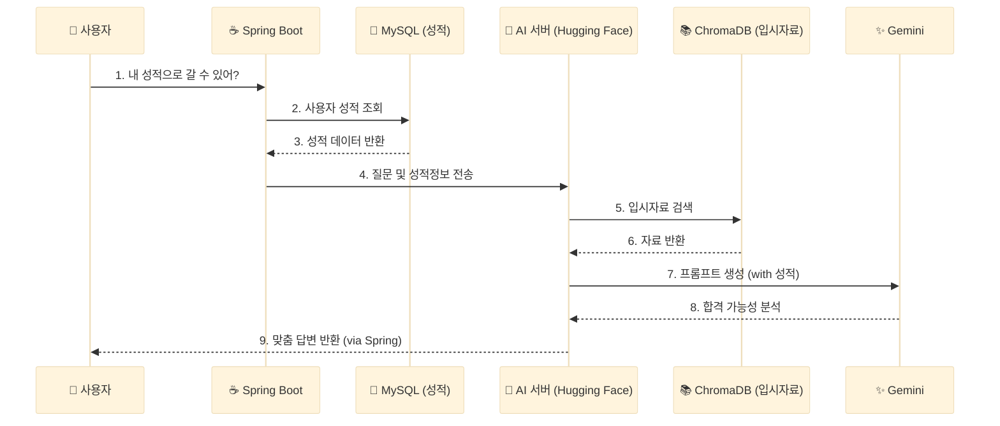

# 🏗️ Chatbot System Architecture

이 문서는 Spring Boot 백엔드와 Python AI 서비스 간의 상호작용 및 전체 시스템 구조를 설명합니다.

## 1. High-Level Architecture (전체 구조)

Spring Boot 서버와 **Hugging Face**에 배포된 AI 서버가 협력하는 구조입니다.

## 2. System Flow (기본 작동 흐름)

시스템의 기본 작동 과정을 **핵심 단어** 위주로 설명합니다.

### 1단계: 🗣️ [사용자] → [Spring Boot] (질문 접수)

- **행동**: 사용자가 "가천대 입결 알려줘"라고 입력.
- **역할**: Spring Boot가 로그인 여부를 확인하고 질문을 받음.

### 2단계: 📡 [Spring Boot] → [Hugging Face] (전달)

- **행동**: Spring Boot가 질문을 **Hugging Face Spaces** 클라우드에 떠 있는 AI 서버로 토스.
- **역할**: 무거운 AI 연산은 별도 클라우드(Hugging Face)에서 처리.

### 3단계: 🔍 [Python] ↔ [DB] (정보 검색)

- **행동**: Python 서버가 질문과 관련된 대학/학과 데이터를 DB에서 찾음.
- **결과**: "2026학년도 입시 자료" 확보.

### 4단계: 🧠 [Python] ↔ [Gemini] (답변 생성)

- **행동**: **[질문 + 찾은 자료]**를 Gemini에게 전송.
- **결과**: Gemini가 문맥을 파악하고 자연스러운 답변 생성.

### 5단계: 💬 [Hugging Face] → [Spring Boot] → [User] (완료)

- **행동**: 완성된 답변이 사용자에게 전달됨.

---

## 3. Personalized Recommendation Flow (사용자 성적 연동)

**"사용자 개인 정보(성적)를 활용하여 AI가 맞춤형 상담을 해주는 과정"**입니다.
MySQL에 저장된 성적 정보를 가져와 AI에게 함께 제공합니다.

순서를 더 명확하게 보기 위해 시퀀스 다이어그램으로 표현합니다.

### 상세 절차 (Step-by-Step)

1.  **사용자 요청**: "나 이 학교 갈 수 있을까?"라고 물어봄.
2.  **정보 조회 (Spring Boot ↔ MySQL)**:
    - Spring Boot가 "이 사용자의 등급(성적)이 몇 점이지?" 하고 MySQL DB를 조회함.
    - 예: `국어 3등급, 수학 4등급` 정보를 가져옴.
3.  **데이터 결합 및 전송 (Spring Boot → Python)**:
    - 단순 질문만 보내는 게 아니라, **[질문 + 성적 정보]**를 묶어서 AI에게 보냄.
    - `"질문: 갈 수 있어? / 성적: 국3, 수4"`
4.  **AI 판단 (Python ↔ Gemini)**:
    - Python 서버가 "이 사용자는 국3, 수4 등급입니다. 이 점수로 가천대에 지원 가능한지 분석해 주세요"라고 Gemini에게 구체적으로 요청.
    - 검색된 입시 자료(커트라인)와 사용자의 점수를 **비교 분석**.
5.  **결과 반환**:
    - "지원 가능합니다" 또는 "상향 지원이 필요합니다" 같은 **개인 맞춤형** 답변 생성 및 전달.
