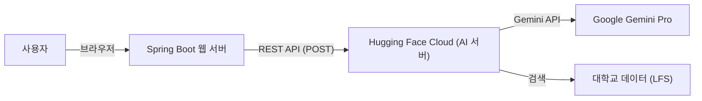

# 🤖 StudyLink AI 챗복 통합 개발 가이드 (Chatbot Integration Guide)

본 문서는 `StudyLink-Web` (Spring Boot) 프로젝트와 파이썬 AI 서버(`chatbot_withpy`)의 통합 과정, 주요 기능, 그리고 배포 구조를 상세히 기술합니다.

---

## 📸 1. 시스템 아키텍처 (Architecture)

### 1.1 구조도



### 1.2 핵심 원리

- **Client-Server 분리**: 웹 서버(Spring Boot)는 UI와 사용자 요청만 담당하고, 무거운 AI 연산은 클라우드(Hugging Face)에 위임합니다.
- **데이터 동기화**: 프로젝트의 `dev` 브랜치를 Pull 받기만 하면, 로컬에 파이썬 환경이 없어도 클라우드 AI와 즉시 통신할 수 있습니다.

---

## 🛠️ 2. 주요 기능 구현 (Implementation Features)

### 2.1 [FE] 프리미엄 챗봇 UI

- **파일 위치**: `src/main/resources/templates/chatbot.html`
- **기능 설명**:
  - 사용자 친화적인 채팅 인터페이스 (카카오톡/슬랙 스타일).
  - **그라데이션 헤더**와 **애니메이션** 메시지 효과로 미려한 디자인 제공.
  - 입력창 엔터(Enter) 키 전송 및 '전송 중' 로딩 인디케이터 구현.
  - AJAX(`fetch`)를 사용하여 페이지 새로고침 없이 비동기로 대화 진행.

### 2.2 [BE] Spring Boot 컨트롤러 및 서비스

- **Controller**: `com.StudyLink.www.controller.ChatbotController`
  - `/chatbot` (GET): 챗봇 페이지 반환.
  - `/chatbot/send` (POST): 사용자 질문을 받아 Service로 전달하고 JSON 응답 반환.
- **Service**: `com.StudyLink.www.service.ChatbotService`
  - `RestTemplate`을 사용하여 외부 AI 서버로 POST 요청 전송.
  - **핵심**: `AI_SERVER_URL` 상수에 Hugging Face의 Public URL(`https://yaimnot23-chatbot-docker.hf.space/chat`)이 등록되어 있음.
  - 예외 처리: 외부 서버 다운 시 "AI 서버 연결 오류" 메시지 반환.
- **DTO**: `com.StudyLink.www.dto.ChatbotDTO`
  - Request: `query` (질문)
  - Response: `answer` (답변), `detected_univ` (감지된 대학), `found_majors` (관련 학과)

### 2.3 [AI] 파이썬 FastAPI 서버

- **파일 위치**: `chatbot_withpy/server.py`
- **기술 스택**: Python 3.12, FastAPI, LangChain, Google Gemini, ChromaDB.
- **기능**:
  1.  **RAG (검색 증강 생성)**: 사용자의 질문을 분석하여 로컬 DB(`db/`)에서 관련 대학/학과 정보를 검색.
  2.  **LLM 응답 생성**: 검색된 데이터를 바탕으로 Gemini Pro에게 답변 작성을 요청.
  3.  **API 제공**: `/chat` 엔드포인트로 JSON 응답 제공.

---

## 🚀 3. 클라우드 배포 파이프라인 (CI/CD)

### 3.1 GitHub Actions & Hugging Face Sync

- **설정 파일**: `.github/workflows/sync.yml`
- **작동 방식**:
  1.  GitHub `main` 브랜치에 코드가 푸시되면 자동 실행.
  2.  **Git LFS**를 설치하고 대용량 파일(`db/`, `.xlsx`)을 가져옴.
  3.  Hugging Face 저장소(`yaimnot23/chatbot_docker`)로 코드를 강제 동기화(Push).
- **결과**: 깃허브에 코드만 올리면 5분 안에 허깅페이스 서버가 자동으로 업데이트됨.

---

## 📝 4. 팀원 협업 가이드 (How to Collaborate)

### 4.1 팀원들이 코드를 받을 때

1.  `dev` 브랜치를 Pull 받습니다.
    ```bash
    git pull origin dev
    ```
2.  Spring Boot 애플리케이션을 실행합니다.
3.  `http://localhost:8080` 접속 -> "AI 상담 챗봇" 버튼 클릭.
4.  **끝!** (파이썬 설치 필요 없음)

### 4.2 개발 시 주의사항

- **API Key 보안**: `GOOGLE_API_KEY`는 코드가 아닌 Hugging Face **Secrets**에만 저장되어 있습니다.
- **서버 상태**: 48시간 동안 사용하지 않으면 Hugging Face가 절전 모드에 들어갈 수 있습니다. 답변이 안 오면 [Hugging Face Space](https://huggingface.co/spaces/yaimnot23/chatbot_docker)에 접속해서 깨워주세요.
